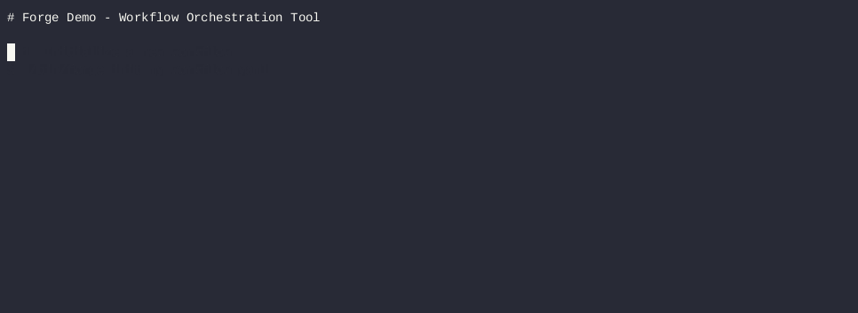

# Forge

[](https://github.com/andre-koe/forge/actions/workflows/ci.yml)
[](https://goreportcard.com/report/github.com/andre-koe/forge)
[](LICENSE)
[](https://github.com/andre-koe/forge/releases/latest)
[](https://github.com/andre-koe/forge/pkgs/container/forge)

Forge is a CLI tool to package and run internal scripts and tools as structured workflows.

It focuses on **reproducible execution**, **clear workflow definitions**, and a **human-centric CLI**.
Forge is designed to start locally and evolve into a more complete orchestration platform over time.

> **Status:** early-stage / pre-MVP.
> The current focus is a minimal, stable CLI and workflow execution model.




---

## Why Forge

In many teams, operational logic lives in ad-hoc scripts, cronjobs, or CI pipelines.
Over time this leads to unclear ownership, hard-to-reproduce runs, and fragile processes.

Forge explores a different approach:
- workflows as explicit artifacts (YAML),
- deterministic step execution,
- a simple CLI designed for developers and operators.

This repository intentionally starts small and favors correctness over features.

---

## Features (current)

- Minimal workflow DSL (YAML)
- `forge init` — creates a workflow template
- `forge run <workflow.yml>` — executes a workflow locally (foreground)
- `forge dry-run <workflow.yml>` — prints the execution plan without running steps
- Versioning, build info, and cross-platform builds (see Makefile)

---

## Quickstart

### Installation

#### Using Docker

```bash
# Pull the latest image
docker pull ghcr.io/andre-koe/forge:latest

# Run with a workflow
docker run -v $(pwd):/workspace ghcr.io/andre-koe/forge:latest run /workspace/workflow.yaml

# Alias for convenience
alias forge='docker run -v $(pwd):/workspace ghcr.io/andre-koe/forge:latest'
```

#### Build from source

```bash
make build
```

The binary will be in `bin/forge`.

#### Install with Go

```bash
go install github.com/andre-koe/forge/cmd/forge@latest
```

### 1) Initialize a workflow project

```bash
./bin/forge init
```
This creates a sample workflow file `workflow.yaml`:

```yaml
# Example Workflow YAML
name: example-forge-workflow
description: Generated by forge init
stages:
- name: hello-stage
  description: A very simple Stage with two steps
  steps:
  - name: hello
    type: exec
    run:
    - echo
    - Hello from Forge
  - name: pause
    type: sleep
    seconds: 1
- name: goodbye-stage
  description: A second Stage to say goodbye
  steps:
  - name: goodbye
    type: exec
    run:
    - echo
    - Goodbye from Forge

```

### 2) Run a workflow

```bash
# Local binary
./bin/forge run workflow.yaml

# Docker
docker run -v $(pwd):/workspace ghcr.io/andre-koe/forge:latest run /workspace/workflow.yaml

# Installed via go install
forge run workflow.yaml
```

### 3) Dry-run (preview execution)

```bash
bin/forge run ./workflow.yml
```

### 4) Dry-run (simulate)te)

```bash
./bin/forge dry-run ./workflow.yml
```
prints the execution plan without running steps

---

## Docker Usage

### Run workflows in a container

```bash
# Using the latest release
docker run -v $(pwd):/workspace ghcr.io/andre-koe/forge:latest run /workspace/workflow.yaml

# Specific version
docker run -v $(pwd):/workspace ghcr.io/andre-koe/forge:0.1.0 run /workspace/workflow.yaml

# Create an alias for convenience
alias forge='docker run -v $(pwd):/workspace ghcr.io/andre-koe/forge:latest'
forge run workflow.yaml
```

### Build your own image

```bash
docker build -t forge:dev .
docker run -v $(pwd):/workspace forge:dev run /workspace/workflow.yaml
```

---

## Development

### Prerequisites

- Go 1.24 or higher
- Make (optional, but recommended)
- Docker (for container builds)

### Building

```bash
# Build for current platform
make build

# Build for all platforms (Linux, macOS, Windows)
make build-all

# Run tests
make test

# Run tests with coverage
make test-coverage

# Run linter
make lint

# Format code
make fmt
```

See the [CONTRIBUTING.md](CONTRIBUTING.md) for detailed development setup including pre-commit hooks.

### Project Structure

```
forge/
├── cmd/               # CLI commands
│   ├── forge/        # Main entry point
│   ├── run.go        # Run command
│   ├── dry_run.go    # Dry-run command
│   ├── init.go       # Init command
│   └── version.go    # Version command
├── internal/
│   ├── dsl/          # Workflow DSL definitions
│   └── runner/       # Workflow execution engine
├── config/           # Configuration handling
└── workflows/        # Example workflows
```

---

## Creating a Demo GIF

Want to add a demo to this README? Here's how:

1. Install [asciinema](https://asciinema.org/): `brew install asciinema` or `apt install asciinema`
2. Record a session:
   ```bash
   asciinema rec demo.cast
   ./bin/forge run workflow.yaml
   # Press Ctrl+D when done
   ```
3. Convert to GIF using [agg](https://github.com/asciinema/agg) or upload to asciinema.org
4. Add to README: ``

---

## Notes

- The CLI is based on [Cobra](https://github.com/spf13/cobra).
- Workflows are described in YAML.
- Version, build time, and commit are set automatically via Git ldflags.

---

## Roadmap (high level)

Deterministic execution plans

Improved validation and error reporting

Run metadata and local artifacts

Background execution (--detach)

Workflow simulation and testing support
